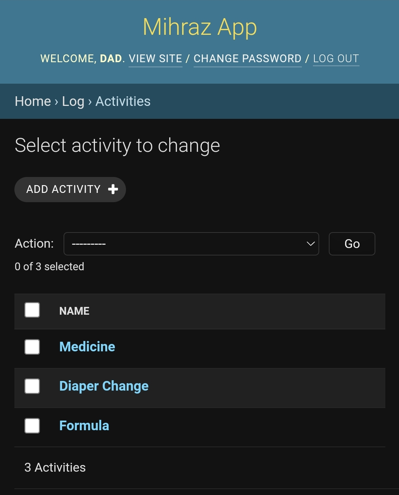
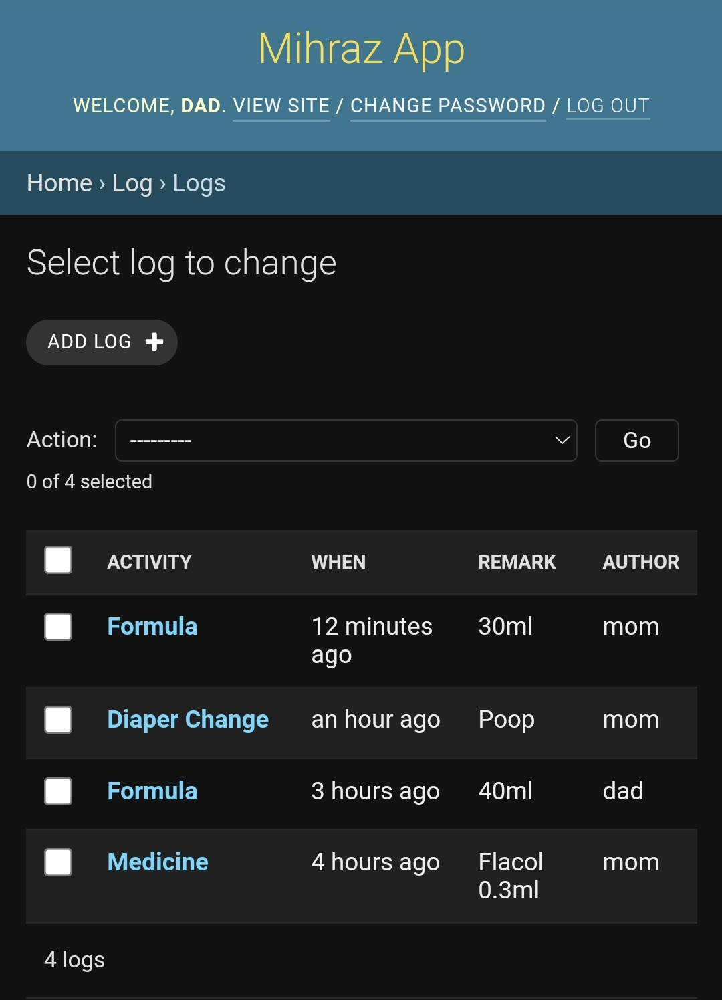
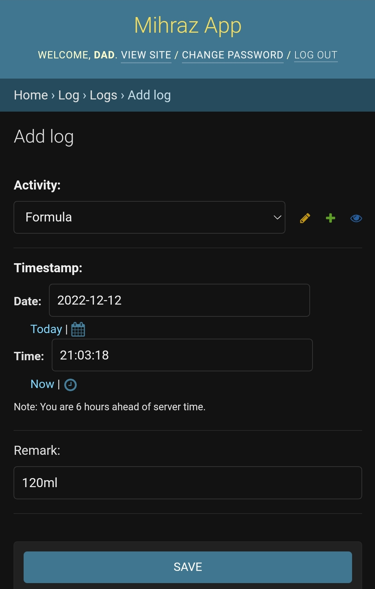

# Baby Log Django

This is a tiny web app that can be used to track baby activities by the parents.

## Install and Run

```
pip3 install -r requirements.txt
python3 manage.py migrate
python3 manage.py createsuperuser --username dad
python3 manage.py createsuperuser --username mom
python3 manage.py runserver
```

Then open `http://127.0.0.1:8000/admin` in the browser.

You can customize the value of `BABY_NAME` in `app/settings.py`.

## Features

- Multiple Activities can be added
- Timestamp and Remark can be added per Activity
- Logged in user's ID will be added under Author filed
- Timestamp is shown in human readable, natural format
- Multiple Users can be added to manage the portal

## Screenshots






